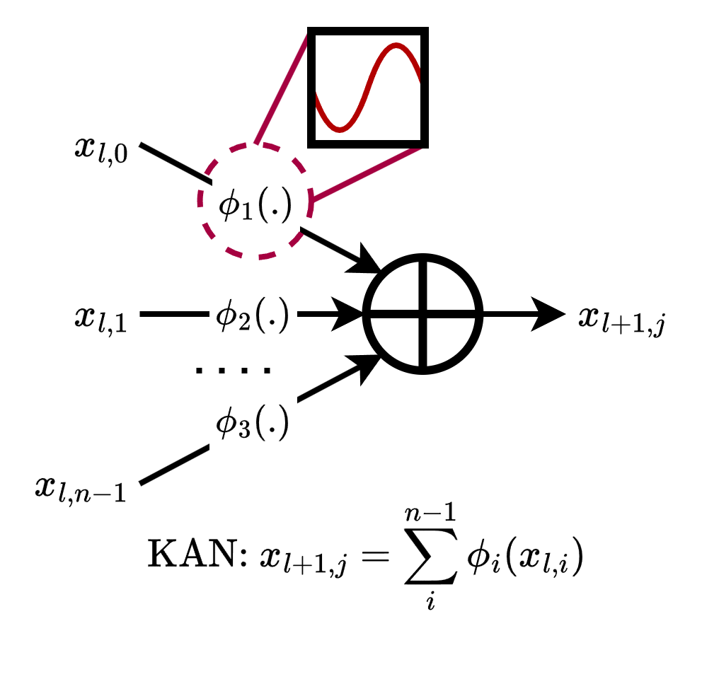
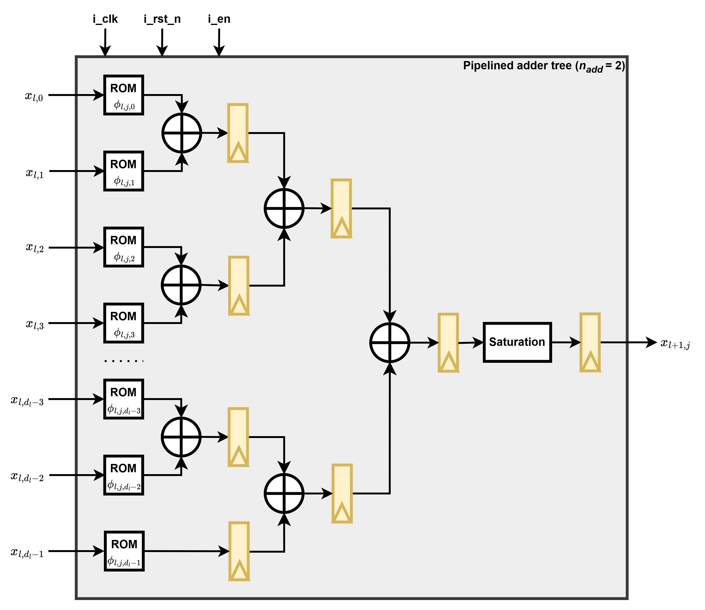
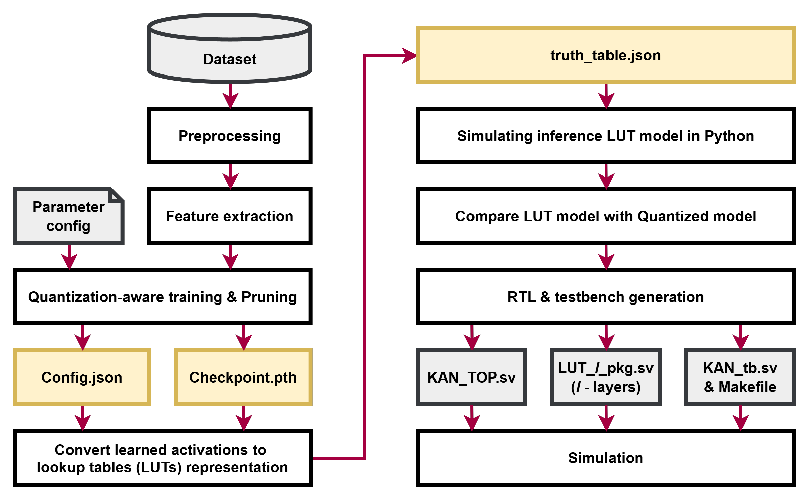
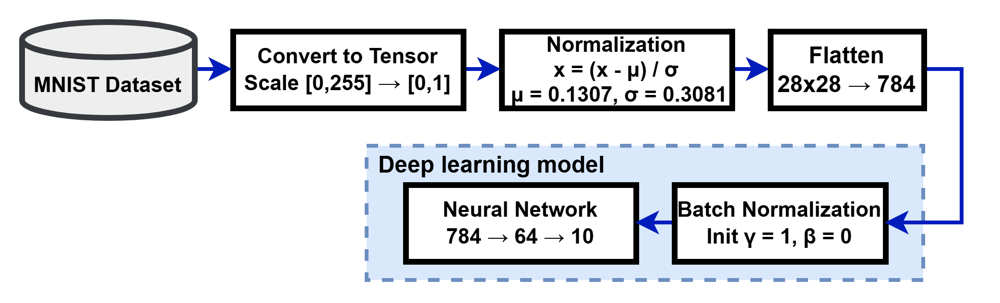
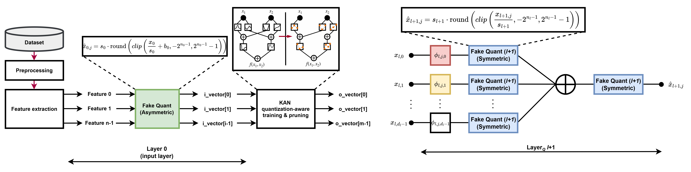
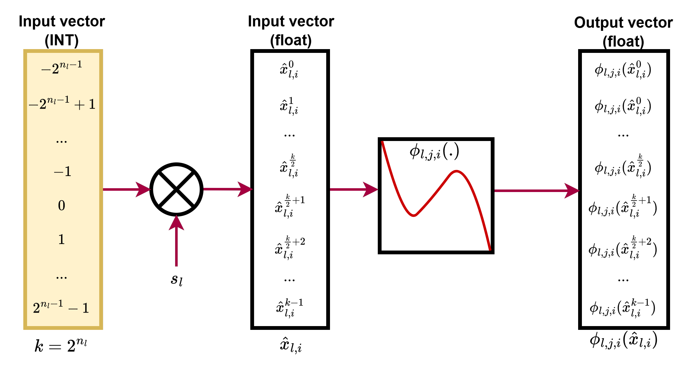
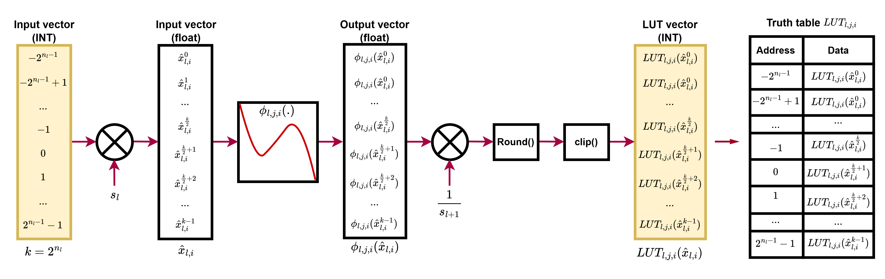
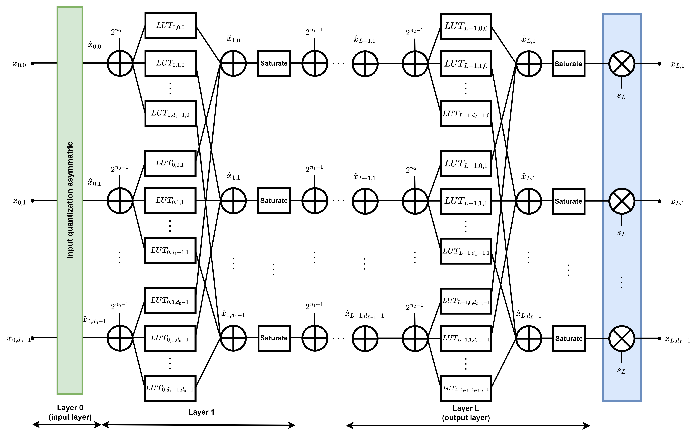
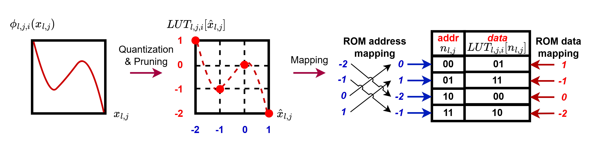
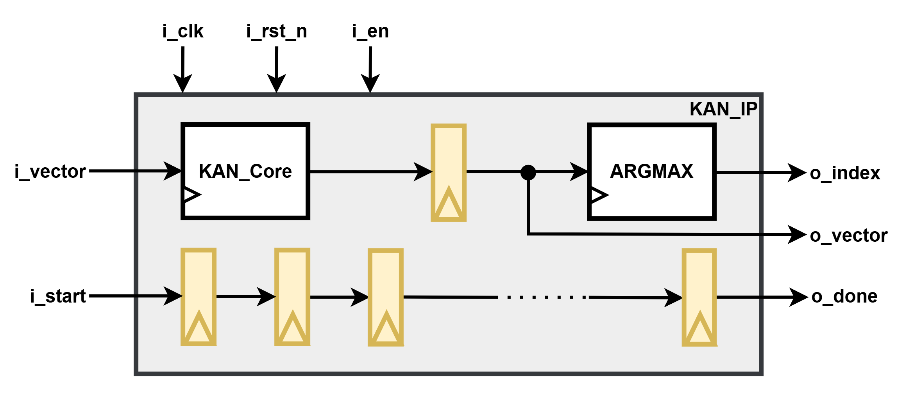

# Thesis-KAN-LUT-Based-Automatically-Generating-

Đồ án đề xuất một framework tự động chuyển một mạng **KAN (Kolmogorov-Arnold Network)** đã huấn luyện thành **mã phần cứng SystemVerilog** dựa trên **LUT (Look-Up Table)**, kèm sẵn testbench và vector kiểm thử. Tài liệu này lấy bài toán **MNIST (784 → 64 → 10)** làm ví dụ xuyên suốt.

---

## 1. Ý tưởng cốt lõi

Trong KAN, mỗi **cạnh (edge)** nối nút vào `i` với nút ra `j` là một hàm 1 biến học được:

```
φ(x) = w_base · SiLU(x) + w_spline · Σ_k c_k · B_k(x)  
```

Nút ra là tổng các hàm trên mọi cạnh đi vào: `y_j = Σ_i φ_{j,i}(x_i)`.



Nếu đầu vào `x_i` chỉ nhận **một số ít mức lượng tử** (ví dụ 1 bit hoặc 6 bit), thì `φ(x)` chỉ có **2^bits giá trị khả dĩ**. Ta có thể tính trước toàn bộ và lưu thành bảng tra:


> **Mỗi cạnh KAN = 1 LUT (ROM) có 2^bits_in phần tử, mỗi phần tử rộng bits_out bit.**
> **Mỗi nút = 1 cây cộng các đầu ra LUT + bão hòa (saturate).**

Phần cứng cuối cùng **không có phép nhân, không có SiLU, không có spline**. Chỉ có ROM, bộ cộng và thanh ghi.



Cạnh nào bị **pruning** (cắt tỉa) thì **không sinh phần cứng** → tiết kiệm tài nguyên trực tiếp.

---

## 2. Tổng quan flow



| Bước | File chạy | Đầu ra chính |
|------|-----------|--------------|
| 1 | `KAN_float.py` | Baseline float |
| 2 | `KAN_quant.py` | `models/<timestamp>/config.json`, `MNIST_Acc..._Epoch..._Remainding....pth` |
| 3 | `convert.py` | `truth_table.json`, `firmware/{src,tb,sim}` |
| 4 | `make sim` | Log PASS/FAIL của từng vector test |

---

## 3. Cấu trúc thư mục

```
project/
├── common/                      # Thư viện dùng chung (sys.path.append('../common'))
│   ├── KAN_OG.py                # KAN float gốc
│   ├── KAN_Quant.py             # KANQuant: KAN lượng tử hóa + pruning mask
│   ├── quant.py                 # Wrapper Brevitas, tính state space (trích xuất scale-s và bit sau huấn luyện)
│   ├── os_path.py               # Tiện ích: tìm checkpoint, vẽ đồ thị, fold BN
│   ├── KAN_LUT.py               # ★ Lõi của flow: truth table + sinh RTL + sinh test vector
│   └── templates/               # ★ Template RTL (có các placeholder {{...}})
│       ├── src/  kan_core.sv, kan_top.sv, registers.sv, lut_rom.sv,
│       │         single_port_ram.sv, saturate_clip.sv, gte_comp_sign.sv
│       ├── tb/   tb_kan.sv
│       └── sim/  flist.f, Makefile
└── MNIST/                       # Thư mục thực nghiệm
    ├── KAN_float.py
    ├── KAN_quant.py
    ├── convert.py
    └── models/final/            # config.json + 1 file .pth  (đầu vào của convert.py)
        └── firmware/            # ★ Được sinh tự động
            ├── src/  kan_core_pkg.sv, layer_0_lut_pkg.sv, layer_1_lut_pkg.sv,
            │         kan_core.sv, kan_argmax.sv, kan_top.sv, ...
            ├── tb/   tb_kan.sv, vectors_in.txt, vectors_out.txt, pred_idx.txt
            └── sim/  flist.f, Makefile
```

> `KAN_LUT.py` copy template từ `os.path.dirname(__file__)/templates/...`, nên thư mục `templates` phải nằm cạnh `KAN_LUT.py`.

---

## 4. Chi tiết từng bước (Ví dụ với MNIST)



### Bước 1 – Train KAN float (`KAN_float.py`)

Huấn luyện KAN thuần float làm mốc so sánh: `BatchNorm → KAN([784, 64, 10])`, `grid_range=[-8,8]`, `grid_size=5`, `spline_order=3`, SiLU, AdamW, 50 epoch. Bước này **không bắt buộc** cho flow phần cứng, chỉ để biết trần độ chính xác trước khi lượng tử hóa.

### Bước 2 – QAT + Pruning (`KAN_quant.py`)

Đây là bước quyết định chất lượng và kích thước phần cứng. Mọi tham số nằm trong `config`:

```python
config = {
    "layers"       : [784, 64, 10],  # kích thước các lớp
    "layers_width" : [1, 6, 6],      # bit-width: input=1, hidden=6, output=6
    "grid_range"   : [-8, 8], "grid_size": 5, "spline_order": 3,
    "prune_threshold": 0.2,          # ngưỡng cắt tỉa cuối cùng
    "pecentage_model": 0.05,         # dừng prune khi còn ≤ 5% cạnh
    "warmup_epochs": 10, "target_epoch": 20,
    ...
}
```

**a) Lớp đầu vào (lượng tử hóa 1 bit).**
Pixel → `BatchNorm1d` → cộng bias `-0.25` → `QuantHardTanh` 1 bit. Mỗi pixel chỉ còn 2 mức `{-1, 0} × scale`, nên LUT của lớp đầu chỉ có **2 phần tử**.

**b) Lượng tử hóa đầu ra mỗi cạnh (QAT).**
Trong `KANLinear.forward`, mỗi cạnh được tính `φ(x)`, **lượng tử hóa** (`output_quantizer`), nhân mask `spline_selector`, rồi mới cộng lại và lượng tử hóa lần nữa. Nhờ vậy mô hình khi train **đã mô phỏng đúng** việc "mỗi cạnh là một số nguyên `bits_out` bit, tổng bị bão hòa" của phần cứng.



**c) Pruning.**



Mỗi cạnh `(out, in)` có 1 bit mask trong `spline_selector`:

1. Tính **RMS** của `φ(x)` trên toàn bộ state space của đầu vào cạnh đó.
2. Nếu RMS < ngưỡng → mask = 0 (cạnh bị loại vĩnh viễn).
3. Ngưỡng tăng dần theo epoch: `threshold · (1 − e^(−k·t))`, đạt ~95% tại `target_epoch`, không prune trong `warmup_epochs`.
4. **Backward pruning:** nút ở lớp `l` mà toàn bộ cạnh ra ở lớp `l+1` đã bị cắt → cắt luôn các cạnh vào nút đó.
5. **Forward pruning:** nút ở lớp `l` mà toàn bộ cạnh vào đã bị cắt (nút chết) → cắt các cạnh ra khỏi nút đó.

Kết quả là mạng thưa; số cạnh còn lại = số ROM sẽ được sinh ra.


**d) Lưu checkpoint.**
Sau `target_epoch`, mỗi epoch lưu `models/<timestamp>/MNIST_Acc{..}_Loss{..}_Epoch{..}_Remainding{..}.pth`, cùng `config.json` trong thư mục đó. Chọn checkpoint tốt nhất, chép vào `models/final/` (kèm `config.json`).

> ⚠️ `convert.py` lấy **file `.pth` đầu tiên** trong `models/final/`. Chỉ để đúng **một** file.

### Bước 3 – Chuyển đổi (`convert.py`)

```python
kan_lut = KAN_LUT(model_dir, checkpoint, config, MNIST_input_layer, device)
kan_lut.quick_match_check()
kan_lut.generate_firmware(bram=False, adder_tree=True, n_adder=4, levels_per_stage=2)
kan_lut.test_from_dataset(x, y, hex_gen=True)
```

Lớp input (BN + bias + quantizer) phải được **dựng lại giống hệt** lúc train, vì state của nó nằm trong checkpoint.

#### 3.1 Sinh truth table (`KAN_LUT.__init__` → `generate_truth_table`)

Với mỗi cạnh, key dạng `"{layer}_{out}_{in}"`:

```python
{
  "active": 1,                     # 0 nếu đã bị prune
  "values_int": [ ... 2^bits_in số nguyên ... ]
}
```

Cách tính `values_int`:

1. Lấy **state space** của đầu vào (toàn bộ mức lượng tử, sắp xếp từ âm nhất đến dương nhất).
2. Tính `φ(state) = w_base·SiLU(state) + spline(state)` (dùng `b_spline_line`).
3. Chia cho `scale` của quantizer đầu ra, làm tròn, **kẹp** vào `[min_state, max_state]` (ví dụ 6 bit signed: `[-32, 31]`).

Kết quả được cache vào `truth_table.json`.



> ⚠️ Nếu `truth_table.json` đã tồn tại, nó sẽ được **dùng lại** mà không tính lại. Sau khi đổi checkpoint hoặc train lại, **xóa file này** trước khi chạy `convert.py`.

#### 3.2 Golden model số nguyên (`KAN_LUT_inference`)

Đây là mô hình tham chiếu bit-exact cho phần cứng:

```
Lớp 0 : địa chỉ LUT = giá trị input (đã cộng 2^(bits-1) để thành chỉ số không âm)
Lớp l : địa chỉ LUT = đầu ra lớp trước + 2^(bits-1)
Mỗi nút: acc = Σ values_int[địa chỉ]  (bỏ qua cạnh active=0)
         acc = clip(acc, min_state, max_state)
```



#### 3.3 Kiểm tra nhanh (`quick_match_check`)

Chạy 10 mẫu ngẫu nhiên qua **model float-QAT** và **model LUT**, in sai số lớn nhất và xem `argmax` có trùng không. Nếu `MISMATCH` hoặc `Classification Incorrect` thì **dừng lại**, đừng sinh phần cứng vội.

#### 3.4 Sinh firmware (`generate_firmware`)

Thứ tự thực hiện bên trong:

| # | Hàm | Việc làm |
|---|-----|----------|
| 1 | `write_kan_core` | Copy `templates/{src,tb,sim}`, sinh `kan_core_pkg.sv`, điền `{{SIGNAL_DECLS}}` và `{{LAYER_BLOCKS}}` vào `kan_core.sv`, trả về độ trễ của core |
| 2 | `build_argmax_sv` | Sinh `kan_argmax.sv`, trả về số stage pipeline |
| 3 | `write_pkg_file` | Sinh `layer_<l>_lut_pkg.sv` chứa nội dung mọi LUT, điền `{{PKG}}` vào `kan_core.sv` và `flist.f` |
| 4 | (cuối hàm) | Điền `{{TOTAL_DELAY}}` vào `kan_top.sv`, `{{DELAY_OUTPUT}}` vào `tb_kan.sv` |

Tham số điều khiển:

| Tham số | Ý nghĩa | Đánh đổi |
|---------|---------|----------|
| `bram` | `True`: dùng `single_port_ram` (M9K/BRAM). `False`: dùng `lut_rom` (LUT logic) | LUT của mạng này rất nhỏ (2–64 phần tử), thường nên dùng logic (`False`) để không tốn cả block RAM cho mỗi cạnh |
| `adder_tree` | `True`: cộng theo cây, có pipeline | `False`: một phép cộng dài, 1 thanh ghi, tần số thấp hơn |
| `n_adder` | Số toán hạng cộng trong mỗi tầng cây (≥ 2) | Lớn → ít tầng (ít latency) nhưng đường tổ hợp dài hơn |
| `levels_per_stage` | Số tầng so sánh argmax giữa hai thanh ghi pipeline | Lớn → ít latency, tần số thấp hơn |

**Chi tiết một nút phần cứng** (ví dụ lớp `l`, nút `j`):

```
i_vector[i] / out_{l-1}_i_reg
        │ (địa chỉ)
        ▼
  ┌───────────┐  acts_l_j_i  (bits_out, có thanh ghi đầu ra)
  │  lut_rom  │──────────────┐
  └───────────┘  × (số cạnh active của nút)
                             ▼
                sign-extend thêm log2(n_add) bit / tầng
                             ▼
              ┌──── cây cộng n_add-ngõ, mỗi tầng 1 thanh ghi ────┐
                             ▼
                sum_l_j_reg  (rộng bits_out + depth·log2(n_add))
                             ▼
                      saturate_clip  → về bits_out
                             ▼
      lớp giữa: thanh ghi node_l_j → làm địa chỉ cho lớp sau
      lớp cuối: nối thẳng ra o_vector[j]
```

Điểm quan trọng để phần cứng **khớp bit** với golden model:

- **Bề rộng cộng đủ lớn:** mỗi tầng cộng mở rộng thêm `ceil(log2(n_add))` bit biểu diễn nên không bao giờ tràn giữa chừng. Chỉ bão hòa **một lần ở cuối**, giống hệt `clip` trong golden model.
- **Địa chỉ ROM = mã bù 2 của giá trị có dấu.** Mã bù 2 của số âm nằm ở nửa trên của không gian địa chỉ, nên `write_pkg_file` **hoán đổi hai nửa** của bảng (`values[half:] + values[:half]`) để địa chỉ bit thô trỏ đúng phần tử.
- **Nút không còn cạnh vào:** không sinh logic (nhờ forward pruning, cạnh ra của nó cũng đã bị cắt). Riêng ở lớp cuối, `o_vector[j]` được gán `'0`.



**Độ trễ (latency)** được tính tự động:

```
mỗi lớp giữa : 1 (LUT reg) + layer_depth (cây cộng) + 1 (node reg)
lớp cuối     : 1 (LUT reg) + layer_depth
tổng         = Σ các lớp + số stage argmax, +1 thanh ghi đầu ra ở kan_top
```

`layer_depth = ceil(log_{n_add}(số cạnh active nhiều nhất của một nút trong lớp))`.

**Argmax** (`build_argmax_sv`): cây so sánh nhị phân bằng `gte_comp_sign` (so sánh có dấu), truyền cả giá trị và chỉ số, tự chèn thanh ghi pipeline sau mỗi `levels_per_stage` tầng. Với 10 lớp: độ sâu cây = 4, `levels_per_stage=2` → 2 stage. Nút lẻ được chuyển thẳng lên tầng trên.

**`kan_top`**: bọc `kan_core` + thanh ghi đầu ra + `kan_argmax` + thanh ghi dịch `delay` để tạo tín hiệu `o_done` (lên đúng `TOTAL_DELAY + 1` chu kỳ sau `i_start`).



#### 3.5 Sinh vector test (`test_from_dataset`)

`convert.py` lấy tập con **cân bằng** của MNIST test (`N=100` ảnh/lớp = 1000 vector, có seed để tái lập), rồi:

1. Cho ảnh qua lớp input lượng tử hóa → số nguyên (vector đầu vào cho RTL).
2. Chạy `KAN_LUT_inference` → **đầu ra 10 chiều mong đợi** và **chỉ số dự đoán**.
3. Ghi `vectors_in.txt`, `vectors_out.txt`, `pred_idx.txt` (và bản hex nếu `hex_gen=True`) vào `firmware/tb/`.
4. Điền `{{TEXT}}` (số test) vào `tb_kan.sv`.

### Bước 4 – Mô phỏng RTL 

Framework hỗ trợ mô phỏng với Cadence XCELIUM, khi đổi sang công cụ mô phỏng (modelsim, verilator,...) khác **cần thay đổi lại bước này**. File `tb_kan.sv` được tự động sinh vẫn hoạt động chính xác ở các công cụ mô phỏng khác.

```bash
cd models/final/firmware/sim
make sim        # xrun (Cadence Xcelium), đọc ../sim/flist.f
make gui        # mô phỏng với GUI
make wave       # mở SimVision với waves.shm
make clean      # dọn file sinh ra khi mô phỏng
```

`tb_kan.sv` cho từng vector: nạp `i_vector` → pulse `i_start` → chờ `DELAY_OUTPUT` chu kỳ → so sánh `o_vector` và `o_index` với file mong đợi. Cuối log có bảng tổng kết:

```
[TEST 0001] PASS | output=OK | pred=OK
...
 Total Tests : 1000
 Passed      : 1000
 Failed      : 0
 Result      : *** ALL TESTS PASSED ***
```

Vì golden model và RTL đều là số nguyên, kết quả phải **khớp tuyệt đối** (không có sai số cho phép). Bất kỳ `FAIL` nào cũng là lỗi thật, và testbench in ra chính xác nút đầu ra nào lệch.

---

## 5. Hướng dẫn sử dụng nhanh

```bash
# 1. (Tùy chọn) baseline float
python KAN_float.py

# 2. Train lượng tử hóa + pruning (chỉnh config trong file)
python KAN_quant.py
#    → chọn checkpoint tốt nhất, chép cùng config.json vào models/final/

# 3. Chuyển đổi + sinh phần cứng + sinh vector test
rm -f models/final/truth_table.json     # nếu đã train lại
python convert.py
#    Nếu thư mục firmware đã tồn tại, script hỏi có xóa không (y/n)

# 4. Mô phỏng
cd models/final/firmware/sim && make sim
```

**Cài đặt cần có:** `torch`, `torchvision`, `brevitas`, `numpy`, `matplotlib`, `seaborn`, `scikit-learn`, `tqdm`; trình mô phỏng Cadence Xcelium (`xrun`) cho bước 4.

---

## 6. Áp dụng cho bài toán khác (ngoài MNIST)

Flow không phụ thuộc MNIST. Muốn dùng cho dataset khác, chỉ cần đổi các điểm sau:

1. `config["layers"]` và `config["layers_width"]` (kích thước lớp và bit-width từng lớp).
2. Bộ nạp dữ liệu và bước tiền xử lý / lượng tử hóa lớp input trong `KAN_quant.py` và `convert.py`.
3. Ngưỡng và lịch pruning (`prune_threshold`, `pecentage_model`, `warmup_epochs`, `target_epoch`).

Phần sinh RTL (`KAN_LUT.py` + `templates/`) tự đọc kích thước từ `config`, nên **không cần sửa**.


---

## 7. Bảng tóm tắt file

| File | Vai trò |
|------|---------|
| `KAN_OG.py` | KAN float gốc (B-spline + SiLU) |
| `KAN_Quant.py` | `KANQuant`: KAN lượng tử hóa, mask pruning, lịch prune |
| `quant.py` | Bọc Brevitas, tính state space/scale/bit-width của quantizer |
| `os_path.py` | Tìm checkpoint, vẽ đồ thị/ma trận nhầm lẫn, fold BN |
| `KAN_LUT.py` | Truth table, golden model, sinh RTL, sinh vector test |
| `kan_core.sv` | Template lõi: các lớp LUT + cây cộng (điền tự động) |
| `kan_top.sv` | Top: core + thanh ghi ra + argmax + `o_done` |
| `lut_rom.sv` / `single_port_ram.sv` | Hai kiểu hiện thực LUT (logic / block RAM) |
| `registers.sv` | Thanh ghi có enable, reset bất đồng bộ |
| `saturate_clip.sv` | Bão hòa/mở rộng dấu về bề rộng đích |
| `gte_comp_sign.sv` | So sánh `≥` có dấu cho argmax |
| `tb_kan.sv` | Testbench so RTL với golden model |
| `flist.f`, `Makefile` | Danh sách file và lệnh mô phỏng Xcelium |